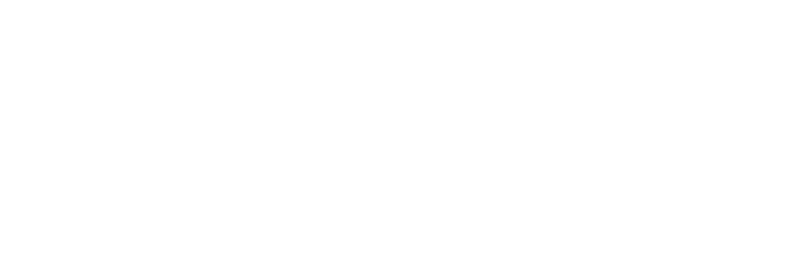
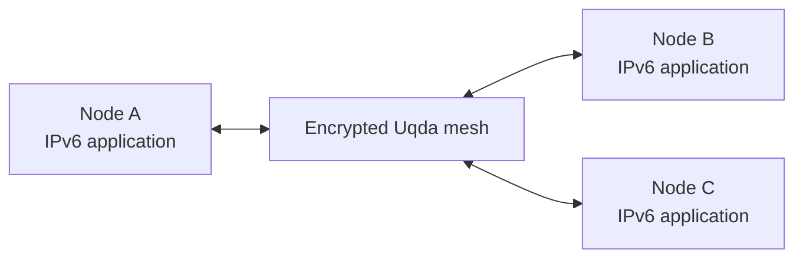

<div align="center">
  

# Uqda Core 🌐

**A fully encrypted, self-organizing IPv6 mesh network.**  
No center. No owner. No single point of failure.

[](https://github.com/Uqda/Core/actions/workflows/ci.yml)
[](https://go.dev/)
[](https://goreportcard.com/report/github.com/Uqda/Core)
[](LICENSE)

[Documentation](https://uqda.github.io/) · [Installation](https://uqda.github.io/installation.html) · [Configuration](https://uqda.github.io/configuration.html) · [Changelog](CHANGELOG.md)
</div>

> **Uqda** (Arabic: **عُقَد**, “nodes” or “knots”) creates a private IPv6 overlay that can operate across IPv4 or IPv6 transports.

## Why Uqda?

- **End-to-end encrypted** — traffic between nodes is protected cryptographically.
- **Self-organizing** — nodes discover routes without a central coordinator.
- **IPv6-native** — existing IPv6-capable applications can communicate over the mesh.
- **Cross-platform** — Linux, macOS, Windows, FreeBSD, OpenBSD, OpenWrt, EdgeRouter, and VyOS.
- **Transport-flexible** — connect peers across TCP, TLS, QUIC, WebSocket, SOCKS, and Unix sockets.

## How it works

Each node creates a virtual network interface and receives a stable IPv6 address derived from its cryptographic identity. Peering links join nodes into an encrypted overlay; routing adapts automatically as links appear or disappear.



## Quick start

### Build from source

Requirements: [Go 1.25 or newer](https://go.dev/dl/) and Git.

```bash
git clone https://github.com/Uqda/Core.git
cd Core
./build
```

The build creates two executables in the repository root:

- `uqda` — the mesh node daemon
- `uqdactl` — the local administration client

### Start a node

For a quick local test, start with automatically generated keys and defaults:

```bash
sudo ./uqda -autoconf
```

Creating a TUN interface normally requires administrator privileges. On Linux, you may grant only the required network capability instead of running the process as root:

```bash
sudo setcap CAP_NET_ADMIN=+eip ./uqda
./uqda -autoconf
```

### Use a persistent configuration

Generate a documented HJSON configuration, review it, then start the node:

```bash
./uqda -genconf > uqda.conf
$EDITOR uqda.conf
sudo ./uqda -useconffile ./uqda.conf
```

For machine-readable output, add `-json` when generating the configuration.

### Run with Docker

Build the image locally and give the container access to the TUN device:

```bash
docker build -t uqda-core -f contrib/docker/Dockerfile .
docker run --rm -it \
  --cap-add=NET_ADMIN \
  --device=/dev/net/tun \
  -v uqda-config:/etc/uqda \
  uqda-core
```

The container generates a persistent configuration in the `uqda-config` volume on first start.

## Repository layout

| Path | Purpose |
| --- | --- |
| `cmd/uqda` | Node daemon entry point |
| `cmd/uqdactl` | Administration CLI |
| `src/core` | Mesh protocol, sessions, and transports |
| `src/config` | Configuration loading and defaults |
| `src/tun` | Platform-specific TUN integration |
| `src/admin` | Local administration API |
| `contrib/` | Docker, service, packaging, and platform integrations |
| `.github/workflows/` | CI, container, and package automation |

## Development

```bash
go test ./...
go vet ./...
go build ./...
```

See [CONTRIBUTING.md](CONTRIBUTING.md) before opening a pull request. Every change is checked on Linux, Windows, macOS, FreeBSD, and OpenBSD by GitHub Actions.

## Security

Please do not disclose security vulnerabilities in a public issue. Follow the private reporting guidance in [SECURITY.md](SECURITY.md).

## Community and support

- Use [GitHub Issues](https://github.com/Uqda/Core/issues) for reproducible bugs and feature requests.
- Join `#uqda` on [Libera.Chat](https://libera.chat/) for community discussion.
- Read the [FAQ](https://uqda.github.io/faq.html) for common setup and networking questions.

## License

Uqda Core is distributed under the GNU Lesser General Public License v3 with the additional exception described in [LICENSE](LICENSE).
