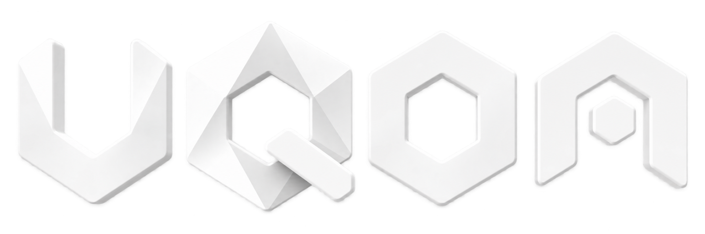

<div align="center">



# UQDA Core

**An encrypted, self-organizing IPv6 overlay network**

[](https://github.com/Uqda/Core/actions/workflows/ci.yml)
[](https://go.dev/)
[](https://goreportcard.com/report/github.com/Uqda/Core)
[](LICENSE)

**English** · [العربية](README_AR.md)

</div>

> **Uqda** (Arabic: **عُقَد**, “nodes” or “knots”) is an experimental userspace router for creating encrypted IPv6 networks over existing IPv4 or IPv6 links.

## Project status

UQDA is experimental software. It has not been independently security-audited and should not be treated as an anonymity system. Use an IPv6 firewall and avoid exposing services that should not be reachable by other network participants.

## Features

- End-to-end encrypted traffic between UQDA nodes.
- Self-organizing multi-hop routing without a central routing authority.
- Cryptographically derived IPv6 addresses tied to node identities.
- Peering over TCP, TLS, QUIC, WebSocket, secure WebSocket, SOCKS, and Unix sockets.
- Optional local multicast discovery.
- TUN integration for ordinary IPv6-capable applications.
- Code and integrations for Linux, macOS, Windows, FreeBSD, OpenBSD, OpenWrt, EdgeRouter, and VyOS.
- Local administration through `uqdactl`.

## How it works

Each node generates a cryptographic identity and derives its IPv6 address from the public key. The daemon creates a virtual TUN interface, establishes configured or locally discovered peerings, and forwards encrypted IPv6 packets across the available mesh paths. Peer links may themselves run over either IPv4 or IPv6 networks.

## Build

Requirements: [Go 1.25 or newer](https://go.dev/dl/) and Git.

```bash
git clone https://github.com/Uqda/Core.git
cd Core
./build
```

The build produces:

- `uqda` — the network daemon;
- `uqdactl` — the local administration client.

## Run

For a temporary node using automatically generated settings:

```bash
sudo ./uqda -autoconf
```

For a persistent configuration:

```bash
./uqda -genconf > uqda.conf
$EDITOR uqda.conf
sudo ./uqda -useconffile ./uqda.conf
```

New nodes remain compatible with existing protocol 0.5 peers. When both sides support the hardened handshake, they negotiate it automatically. To require the hardened handshake on a controlled link and reject legacy peers, append `?secure=required` to both the peer URI and listener URI.

Use `-json` with `-genconf` if strict JSON is preferred over commented HJSON. Creating a TUN interface normally requires administrator privileges. On Linux, the binary may instead be granted the required capability:

```bash
sudo setcap CAP_NET_ADMIN=+eip ./uqda
./uqda -useconffile ./uqda.conf
```

## Docker

```bash
docker build -t uqda-core -f contrib/docker/Dockerfile .
docker run --rm -it \
  --cap-add=NET_ADMIN \
  --device=/dev/net/tun \
  -v uqda-config:/etc/uqda \
  uqda-core
```

The container creates its configuration inside the persistent `uqda-config` volume on first start.

## EdgeOS and VyOS

Integrated router packages are produced by the Packages workflow for
EdgeRouter X (`mipsel`), EdgeRouter Lite (`mips`), and VyOS (`amd64`/`i386`).
After installing the matching `.deb`, create an interface through the native
router CLI:

```text
configure
set interfaces uqda tun0
set interfaces uqda tun0 description UQDA
commit
save
```

Each interface has its own `/config/uqda.tunN.conf`, administration socket,
and `uqda@tunN.service`. Advanced peer settings can be edited in that config,
then applied with `restart uqda tun0`. See [`contrib/vyatta`](contrib/vyatta)
for supported targets and local build commands.

## Repository layout

| Path | Purpose |
| --- | --- |
| `cmd/uqda` | Node daemon entry point |
| `cmd/uqdactl` | Administration CLI |
| `src/core` | Sessions, routing integration, and peer transports |
| `src/config` | Configuration and platform defaults |
| `src/tun` | Platform-specific virtual network interfaces |
| `src/admin` | Local administration API |
| `contrib/` | Containers, service files, packages, and platform integrations |
| `.github/workflows/` | Continuous integration and packaging automation |

## Development

```bash
gofmt -w .
go vet ./...
go test ./...
go build ./...
```

See [CONTRIBUTING.md](CONTRIBUTING.md) before submitting changes. Report suspected vulnerabilities privately as described in [SECURITY.md](SECURITY.md).

## License

UQDA Core is distributed under the GNU Lesser General Public License v3 with the additional exception included in [LICENSE](LICENSE). Third-party components remain subject to their respective licenses.

## Acknowledgements and upstream origin

**UQDA Core is based on and derived from the open-source [Yggdrasil Network](https://github.com/yggdrasil-network/yggdrasil-go) codebase.** UQDA retains substantial concepts and implementation lineage from Yggdrasil while being developed under its own name and repository. Yggdrasil is an independent upstream project; this repository must not imply endorsement by or official affiliation with its maintainers. See [NOTICE.md](NOTICE.md) for attribution details.
